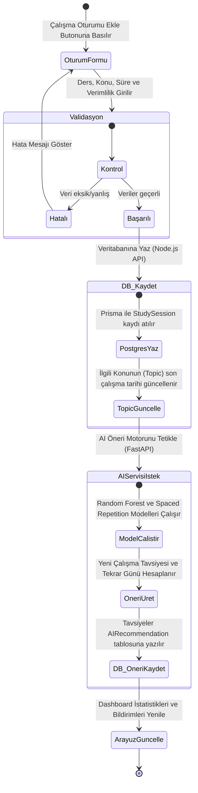
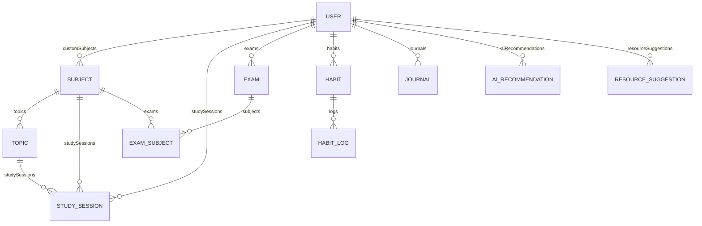

# StudyMentor - UML ve Veritabanı Tasarım Raporu

Bu doküman, StudyMentor projesinin veri şemasını, kullanıcı etkileşimlerini (Use Case) ve veri akışlarını (Aktivite) tanımlayan tasarım kılavuzudur.

---

## 1. Veritabanı Tasarımı (ER Modeli & Tablolar)

Projemizde veri tabanı olarak **PostgreSQL** ve ORM olarak **Prisma ORM** kullanılacaktır. Aşağıda tasarlanan veritabanı şeması yer almaktadır:

### Tablolar ve İlişkiler

#### A. Kullanıcı ve Rol Yönetimi
- **User:** Sistemin ana tablosudur. Öğrenciler ve yöneticiler burada tutulur.
  - `id` (String, UUID)
  - `email` (String, Benzersiz)
  - `passwordHash` (String, Şifrelenmiş)
  - `firstName` & `lastName` (String)
  - `role` (Enum: STUDENT, ADMIN)
  - `educationLevel` (Enum: MIDDLE_SCHOOL, HIGH_SCHOOL, UNIVERSITY, LIFELONG_LEARNER)

#### B. Akademik Modül
- **Subject (Dersler):** LGS, YKS veya üniversiteye göre önceden tanımlanmış veya kullanıcının kendi eklediği dersleri tutar.
  - `userId` (String, Opsiyonel): Null ise genel derstir. Doluysa ilgili kullanıcıya özel derstir.
- **Topic (Konular):** Derslere bağlı alt konuları içerir.
  - `status` (Enum: NOT_STARTED, IN_PROGRESS, COMPLETED)
  - `lastStudied` (DateTime, Son çalışma tarihi)
  - `nextReview` (DateTime, Spaced Repetition algoritmasının belirlediği bir sonraki tekrar tarihi)
- **StudySession (Çalışma Oturumları):** Kullanıcının yaptığı her çalışmanın log kaydıdır.
  - `durationMinutes` (Int, Çalışma süresi)
  - `difficulty` (Int, 1-5 arası zorluk algısı)
  - `productivity` (Int, 1-5 arası verim algısı)
- **Exam (Sınavlar) & ExamSubject (Sınav Ders Detayları):** LGS, YKS veya okul sınavlarının hedeflenen ve alınan sonuç puanlarını tutar. Çok-a-Çok ilişki (M-N) ile bir deneme sınavındaki farklı derslerin net/puan dağılımları izlenebilir.

#### C. Growth Hub (Kişisel Gelişim) Modülü
- **Habit (Alışkanlıklar):** Kullanıcının takip etmek istediği günlük rutinlerdir (örn. Kitap okuma, Spor).
- **HabitLog (Alışkanlık Kayıtları):** Hangi alışkanlığın hangi gün yapılıp yapılmadığını tutar (`date` ve `isCompleted`).
- **Journal (Günlük):** Öğrencinin yazdığı yazıları ve duygu analizlerini saklar.
  - `mood` (String, Seçilen emoji/ruh hali)
  - `sentimentScore` (Float, -1 ile +1 arası AI tarafından hesaplanan duygu skoru)

#### D. AI & Öneri Modülü
- **AIRecommendation:** Makine öğrenmesi modelleri ve Spaced Repetition algoritmaları tarafından üretilen tavsiyelerdir.
- **ResourceSuggestion:** Kullanıcının seviyesine ve eksik olduğu konulara göre önerilen dış kaynak linkleridir (örn: YouTube, BTK Akademi).

---

## 2. UML Diyagramları

### 2.1 Use Case Diyagramı (Kullanım Durumları)

```mermaid
usecaseDiagram
    actor Öğrenci as student
    actor Yönetici as admin
    actor "FastAPI AI Servisi" as ai

    rectangle StudyMentor {
        student --> (Kayıt Ol / Giriş Yap)
        student --> (Çalışma Oturumu Kaydet)
        student --> (Alışkanlık Takip Et)
        student --> (Günlük Yaz ve Mood Seç)
        student --> (Sınav / Geri Sayım Ekle)
        student --> (Gelişim İstatistiklerini İncele)
        student --> (AI Önerilerini Görüntüle)

        (AI Önerilerini Görüntüle) .> (Çalışma Analizi Üret) : <<include>>
        (Günlük Yaz ve Mood Seç) ..> (Sentiment Analizi Yap) : <<extends>>

        ai --> (Çalışma Analizi Üret)
        ai --> (Sentiment Analizi Yap)
        
        admin --> (Sistem Yönetimi)
        admin --> (Predefined Ders/Kaynak Yönetimi)
    }
```

### 2.2 Aktivite Diyagramı (Çalışma Oturumu Ekleme & AI Öneri Akışı)



### 2.3 Entity Relationship Diagram (ERD)


